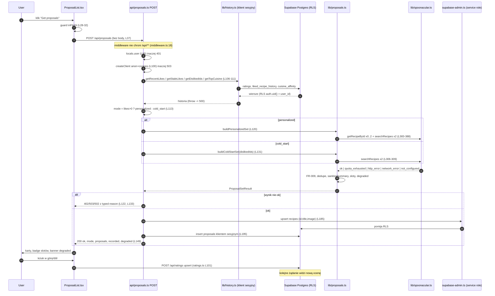

# Research: przepływ danych w osi propozycji

**Data**: 2026-08-10 · **Researcher**: KSchlagowski
**Git commit**: `5a83621` · **Branch**: `master` · **Repo**: Co_jemy

## Pytanie badawcze

Odtworzyć przepływ propozycji end-to-end (entry point → warstwy → zapis/odczyt → powrót), zmapować pokrycie testami i blast radius zmiany, ze szczególnym uwzględnieniem stref ryzyka z `context/map/repo-map.md`. Wyłącznie analiza stanu obecnego.

Metoda: trzy równoległe sub-agenty (trace e2e / luki w testach / blast radius: graf statyczny + co-change z gita). Wszystko poniżej rozdzielone na **evidence** (co robi kod, z `file:line`), **inference** (interpretacja) i **unknown** (biała plama).

**Weryfikacja strukturalna (2026-08-10, ast-grep 0.45.1).** Wszystkie twierdzenia o liczbie call-site'ów, wyłączności („tylko tutaj") i liczności metod zostały przepuszczone przez wzorce ast-grep; każde zero potwierdzono klasycznym grepem, żeby odróżnić realny brak wystąpień od złego wzorca. Wyniki wciągnięto poniżej — poprawki oznaczone **[ast-grep]**. Trzy zera okazały się artefaktem wzorca, nie kodu, i zostały naprawione:
- `export async function $NAME($$$P) { $$$B }` → 0 trafień, bo adnotacja typu zwracanego jest osobnym dzieckiem węzła; poprawny wzorzec to `export async function $NAME($$$P): $RET { $$$B }`.
- `reason: "quota_exhausted"` jako samodzielny wzorzec parsuje się jako labeled statement, nie jako para klucz-wartość → 0 trafień mimo istniejącego kodu.
- Wzorzec wywołania `toCandidate($$$A)` nie łapie przekazania referencji (`.map(toCandidate)`).
Ograniczenie narzędzia: ast-grep nie parsuje plików `.astro`, więc importy z `dashboard/ratings.astro` i `layouts/Layout.astro` policzono grepem.

---

# 1. Feature overview

## 1.1 Streszczenie (evidence)

Jeden endpoint `POST /api/proposals` (`src/pages/api/proposals.ts:91`) bez body i bez parametrów — tożsamość wyłącznie z cookies sesji Supabase (`src/lib/supabase.ts:12-14`). Endpoint jest **węzłem orkiestracji**: czyta historię (4 równoległe zapytania), wybiera tryb, deleguje reguły FR-008 do czystego silnika `src/lib/proposals.ts`, ten woła providera przez `src/lib/spoonacular.ts`, wynik jest sanityzowany, zapisywany dwoma **różnymi** klientami Supabase i zwracany jako jedna koperta JSON.

## 1.2 Ścieżka krok po kroku (evidence)

**A. UI → HTTP**
1. `src/middleware.ts:10-13` — `auth.getUser()`, wynik do `context.locals.user`; `:18-22` redirect `/dashboard` → `/auth/signin` gdy brak usera. **`/api/**` nie jest chronione przez middleware.**
2. `src/pages/dashboard.astro:21` — `<ProposalList client:load />`.
3. `src/components/proposals/ProposalList.tsx:79-80` — klik; `:28`, `:31-32`, `:60-62` — ref `inFlight` jako guard przed podwójnym wysłaniem (motywacja: koszt kwoty).
4. `src/components/proposals/ProposalList.tsx:37` — `POST /api/proposals`, bez body.

**B. Auth + klient**
5. `src/pages/api/proposals.ts:95-98` → 401 `unauthenticated` (własna bramka endpointu).
6. `:100` → `createClient(...)` z `src/lib/supabase.ts:5`; `null` gdy brak `SUPABASE_URL`/`SUPABASE_KEY` (`src/lib/supabase.ts:6-8`, schemat `astro.config.mjs:19-20`) → 503 `service_unavailable` (`:101-103`). Klient = **anon key + cookie sesji**, RLS działa jako `auth.uid()`.

**C. Historia (4 odczyty równolegle, przed jakimkolwiek kosztem kwotowym)**
7. `src/pages/api/proposals.ts:105` — cutoff slotu 2 z `SLOT2_STALE_DAYS = 14` (`src/lib/proposals.ts:53`).
8. `:106-111` — `getRecentLikes` (`src/lib/history.ts:46-62`), `getStaleLikes` (widok `liked_recipe_history`, `src/lib/history.ts:72-90`), `getDislikedIds` (FR-009, `src/lib/history.ts:98-110`), `getTopCuisine` (widok `cuisine_affinity`, `src/lib/history.ts:171-185`). Każdy błąd rzuca → łapie koperta `:150-159` → 500 `internal_error`.
9. `:113` — `mode = recentLikes.length > 0 ? "personalized" : "cold_start"`.

**D-1. Personalized (FR-008)** — `src/lib/proposals.ts:368`
10. `:371` slot 1 = najnowszy like (`SLOT1_MIN_LIKES = 1`, `:51`); `:373` slot 2 = pierwszy stale like różny od slotu 1; `:374` `slot3Active` dopiero przy `SLOT3_MIN_LIKES = 5` (`:55`) **i** niepustym `topCuisine`.
11. `:378-380` — `pickCuisinePair()` (`:244-248`) gwarantuje dwie różne kuchnie; slot 3 pinuje kuchnię z affinity, slot 4 unika kolizji.
12. `:383-388` — **maksymalnie 4 wywołania providera**: 0–2 `getRecipeById` + 2 `searchRecipes` (`number: PER_CALL = 20` `:58`, `sort: random`, `offset: randomOffset()` bound `MAX_OFFSET = 20` `:65`).
13. `:390-396` zbiór wykluczeń = dislikes ∪ recentLikes ∪ staleLikes; `:398-409` filtr obu pul (FR-009 + „polubione nigdy nie udaje nowego").
14. Wypełnianie slotów `:425-449`, wektor `asDesigned` `:453`, backfill `:457-460`, kompaktowanie `:462-467`. Niewypełnione sloty zostają puste („do 4").
15. `:471-477` — porażka całego zestawu tylko gdy nic się nie da zbudować **i** któreś wywołanie padło; `preferFailure` `:288-290` priorytetyzuje `quota_exhausted`. Dwa zdrowe, ale puste searche → `ok:true, proposals: []` (`:479`).

**D-2. Cold start (US-02)** — `src/lib/proposals.ts:302`
16. `:306-309` dwa searche pinowane na różne kuchnie; `:311-314` podwójna porażka → typed failure; `:317-328` pojedyncza porażka → zestaw jednokuchniowy; `:316/:319/:325` wykluczenia FR-009; `:265-281` interleave A,B,A,B z dedupem po id; `:330` `slice(0, SET_SIZE = 4)`; `:335-337` `degraded` = mniej niż 2 **różne kuchnie w gotowym zestawie**.

**E. Provider** — `src/lib/spoonacular.ts`
17. `:121-133` `complexSearch` z `addRecipeInformation=true` (`:122`), offset klampowany 0..900 (`:126`); `:136-141` `/recipes/{id}/information`.
18. Transport `:76-115`: brak klucza → `not_configured` (`:81-83`); klucz w query (`:89`, URL traktowany jak sekret); throw fetch → `network_error` (`:92-98`); 402 → `quota_exhausted` (`:101-103`); inne non-2xx → `http_error` (`:104-106`); zły JSON → `network_error` (`:108-113`). Nagłówki kwoty parsowane (`:39-49`) ale **nigdy nieużywane**.
19. `:54-72` `toCandidate` — biała lista 7 pól (`RecipeCandidate` `:6-14`), `null` gdy brak sensownego `id`/`title`. **To jest miejsce egzekwowania FR-011 po stronie wejścia.**

**F. Sanityzacja** — `src/lib/proposals.ts:211-241` `sanitizeSummary`: strip tagów (`:216`), dekodowanie encji (`:142-153`), cięcie na pierwszym trafieniu `NUTRITION_FIGURE`/`NUTRITION_CLAIM`/`PROVIDER_MENTION` (`:73`, `:81-85`, `:155-160`), cofnięcie do granicy zdania (`:164-175`), `MIN_EXCERPT = 40` → `null` (`:233-235`), `MAX_EXCERPT = 160` (`:240`). Surowe `summary` nigdy nie trafia na wire (`src/pages/api/proposals.ts:33-49`).

**G. Zapis** — `persist`, `src/pages/api/proposals.ts:162-209`
20. `:176` `createAdminClient()` (`src/lib/supabase-admin.ts:15-22`) → `:185-188` upsert `recipes(spoonacular_id, title, image)` z `onConflict:"spoonacular_id"`, **bez** `ignoreDuplicates` (upsert naprawczy).
21. `:195-202` insert `proposals(user_id, spoonacular_id, requested_cuisine, requested_type)` klientem **sesyjnym** — RLS pilnuje własności.
22. `:143-147` — zapis nigdy nie wywraca odpowiedzi; błąd → `recorded:false` (punkt kwoty jest już wydany).

**H. Odpowiedź i powrót do UI**
23. `:149` 200 `{ ok, mode, proposals, recorded, degraded }`; mapa statusów `:18-23` używana w `:122` i `:133`; koperta catch `:150-159` z redakcją `apiKey=` (`:157`).
24. `src/components/proposals/ProposalList.tsx:38-44` — klient **nie sprawdza `response.status`**, tylko `data.ok`; `:46-51` pusty zestaw → syntetyczny `no_results`; `:102-109` banner `degraded`; `:113-117` badge slotu tylko dla `personalized && asDesigned`.
25. `src/components/proposals/RecipeCard.tsx:70-72` — FR-010: `sourceUrl` główny, `spoonacularSourceUrl` fallback, allowlist schematów w `src/lib/safe-url.ts:8-19`; fallback obrazka `:24`, `:81-95`.
26. Domknięcie pętli: `RecipeCard.tsx:48-52` → `POST /api/ratings` → `src/pages/api/ratings.ts:101-109` (upsert klientem sesyjnym) → następne żądanie widzi nową ocenę w krokach 8–9.

## 1.3 Diagram



## 1.4 Kontrakt danych (evidence)

**Request:** `POST /api/proposals` — brak body, query, nagłówków.

**200:**
```jsonc
{ "ok": true, "mode": "cold_start" | "personalized", "recorded": bool, "degraded": bool,
  "proposals": [ { "id", "title", "image", "excerpt", "sourceName", "sourceUrl",
                   "spoonacularSourceUrl", "requestedCuisine", "slot": 1|2|3|4,
                   "ratingVerdict": "like"|null, "asDesigned": bool } ] }
```
(`src/pages/api/proposals.ts:33-49`, `:149`)

**Błędy:** 401 `unauthenticated` (`:97`), 503 `service_unavailable` (`:102`), 402 `quota_exhausted` / 503 `not_configured` / 502 `http_error` / 502 `network_error` (`:18-23`), 500 `internal_error` (`:158`).

**Tabele:** READ `ratings` (`src/lib/history.ts:48-52`, `:100-103`), widoki `liked_recipe_history` (`:75-79`), `cuisine_affinity` (`:174-178`); WRITE upsert `recipes` (admin, `src/pages/api/proposals.ts:186`), insert `proposals` (sesja, `:196-201`), upsert/delete `ratings` (sesja, `src/pages/api/ratings.ts:101-109`, `:159-164`).

## 1.5 Wybór klienta Supabase i RLS (evidence — strefa ryzyka #1 z repo-map)

| Krok | Klient | Polityka |
|---|---|---|
| odczyty historii (`src/lib/history.ts:47,73,99,172`) | sesyjny | `"users read their own ratings"` — `supabase/migrations/20260808120000_rate_recipe.sql:38-40`; widoki `security_invoker` — `20260809120000_personalized_proposal_slots.sql:28-40`, `:48-61` |
| upsert `recipes` (`src/pages/api/proposals.ts:185`) | **service-role** (`src/lib/supabase-admin.ts:15`) | insert dla `authenticated` **cofnięty**: `drop policy ... / revoke insert on public.recipes from authenticated;` — `supabase/migrations/20260809180000_manage_rated_recipes.sql:28-29`. Read pozostaje: `20260720181257_cold_start_proposals.sql:47-49` |
| insert `proposals` (`:195`) | sesyjny | `"users insert their own proposals"` — `20260720181257_cold_start_proposals.sql:64-66` |
| `ratings` upsert/delete | sesyjny | `20260808120000_rate_recipe.sql:42-49`, `20260809180000_manage_rated_recipes.sql:23-25` |

**Inference:** rozdział klientów jest bezpośrednią odpowiedzią na lesson „Shared catalogue tables under anon-key RLS" — `recipes` jest czytane międzykontowo, więc zapisy zdjęto z anon key, a wszystko kluczowane userem zostało na kliencie sesyjnym, żeby RLS pozostało punktem egzekwowania (komentarz `src/lib/supabase-admin.ts:11-13`). Ryzyko #1 z repo-map jest więc **świadomie zaadresowane**, nie otwarte.

## 1.6 Macierz gałęzi (evidence)

| Warunek | Miejsce | Skutek |
|---|---|---|
| brak sesji | `api/proposals.ts:95` | 401 |
| brak env Supabase | `lib/supabase.ts:6` | 503 |
| błąd dowolnego odczytu historii | `lib/history.ts:53/80/104/179` | 500 `internal_error` |
| zero like'ów (także „same dislike'i") | `api/proposals.ts:113` | cold start (wykluczenia nadal działają) |
| brak `SPOONACULAR_API_KEY` | `lib/spoonacular.ts:81` | 503 `not_configured` |
| 402 providera | `lib/spoonacular.ts:101` | 402, priorytet nad innymi (`lib/proposals.ts:289`) |
| 1 z 2 searchy padł (cold start) | `lib/proposals.ts:311` | 200, jedna kuchnia, `degraded:true` |
| zdrowe wywołania, 0 wyników po wykluczeniach | `lib/proposals.ts:471-477` | 200 z `proposals: []` → UI `no_results` |
| slot 1/2 by-id padł | `lib/proposals.ts:430-441` | `degraded:true` + backfill |
| `slot3Active === false` | `lib/proposals.ts:374`, `:453` | slot wypełniony, `asDesigned:false`, **bez** degrade |
| slot 4 niewypełniony | `lib/proposals.ts:449` | cicho krótszy zestaw, nigdy nie degraduje |
| brak `SUPABASE_SERVICE_ROLE_KEY` | `api/proposals.ts:176-183` | 200 z `recorded:false`; późniejsze oceny → FK 404 `unknown_recipe` (`api/ratings.ts:112`) |
| wadliwy wiersz od providera | `lib/spoonacular.ts:56-61` | cicho odrzucony, zestaw się kurczy |
| excerpt < 40 znaków po ratunku | `lib/proposals.ts:233-235` | `excerpt: null` |
| nie-http(s) `sourceUrl`/`image` | `lib/safe-url.ts:18` | link/obrazek pominięty, zostaje kredyt tekstowy |

## 1.7 Blast radius — co zmienia się razem (evidence + inference)

**Szwy interfejsu.** `ProposalMode` (`src/pages/api/proposals.ts:26`) i `ProposalPayload` (`:33-49`) mają **jedną deklarację**, re-eksportowaną type-only w `src/components/proposals/types.ts:9,12` — zmiana pola wychodzi jako błąd kompilacji w wyspie. **[ast-grep — doprecyzowane]** Szew jest asymetryczny inaczej, niż opisywała pierwsza wersja: koperta sukcesu **nie jest przepisana dwustronnie — po stronie serwera nie ma jej wcale**. `api/proposals.ts` nie deklaruje żadnego typu odpowiedzi 200; zwraca literał obiektowy w locie (`:149`). Jedyna deklaracja to `ProposalsResponse` (`types.ts:16-18`) po stronie klienta — i ona **komponuje** importowane `ProposalPayload`/`ProposalMode`, więc ręcznie przepisane są wyłącznie pola koperty (`ok`, `recorded`, `degraded`, `reason`). Osobno stringi `reason`: serwer je *wyprowadza* z uniona silnika (`type FailureReason = Extract<ProposalSetResult, { ok: false }>["reason"]`, `:13`), co domyka `STATUS_BY_REASON` (`:18-23`) na poziomie typów — ale klient rozszerza je do gołego `string` (`types.ts:18`). Wniosek jest ostrzejszy: **dodanie powodu jest bezpieczne** (serwer się nie skompiluje bez wiersza w mapie), natomiast **zmiana nazwy powodu albo pola koperty jest całkowicie niewidoczna dla typów** i broniona wyłącznie przez `src/pages/api/__tests__/proposals.test.ts`. *To nadal najwyżej ryzykowny szew przepływu (inference).*

**Fan-in / fan-out (evidence, **[ast-grep]** — liczby przeliczone, produkcja rozdzielona od testów).** `src/lib/supabase.ts` — **10 importerów produkcyjnych** (`middleware.ts:2`, 5 endpointów auth `signup/signout/confirm/signin/callback:2`, `api/ratings.ts:2`, `api/proposals.ts:2`, `pages/dashboard/ratings.astro:4`, `lib/history.ts:1` type-only) **+ 2 testowe** (`lib/__tests__/history.test.ts:4`, `api/__tests__/proposals.test.ts:22`, `api/__tests__/ratings.test.ts:10` — 3, razem 13 miejsc) przy **1 commicie w historii**: najszerszy blast radius, praktycznie zamrożony. `src/lib/supabase-admin.ts` — **1 importer produkcyjny** (`api/proposals.ts:3`) + 1 testowy (`api/__tests__/proposals.test.ts:23`); `createAdminClient()` ma **dokładnie jedno wywołanie w kodzie produkcyjnym** — `api/proposals.ts:176`. `src/lib/spoonacular.ts` — potwierdzone: 1 importer produkcyjny (`lib/proposals.ts:1`) + 2 testowe (`lib/__tests__/spoonacular.test.ts:2`, `lib/__tests__/proposals.test.ts:14`); granica providera czysta. `src/components/proposals/RecipeCard.tsx` — 7 commitów, współzmienia się z `types.ts` w **4 na 4** commitach tego pliku i dzieli `RatingButton.tsx` **dokładnie z jednym innym konsumentem** (`components/ratings/RatedRecipesList.tsx:3`; importerów `RatingButton` jest w repo 2) — realnym centrum blast radius po stronie klienta jest karta, nie lista.

**Kształty wywołań — potwierdzone [ast-grep].** W całym repo są **3** wywołania `Promise.all`, i wszystkie trzy są węzłami tego przepływu: `api/proposals.ts:106` (4 równoległe odczyty historii), `lib/proposals.ts:306` (2 searche cold-startu), `lib/proposals.ts:383` (0–2 by-id + 2 searche personalized). Budżet „maksymalnie 4 wywołania providera na zestaw" jest więc strukturalnie domknięty: `searchRecipes` ma **4 call-site'y produkcyjne** (`lib/proposals.ts:307,308,386,387` — po dwa na tryb, nigdy oba tryby naraz) i 3 testowe; `getRecipeById` ma **2 call-site'y**, oba warunkowe (`lib/proposals.ts:384,385`). Żadnego wywołania providera poza `lib/proposals.ts`.

**Co-change z gita (evidence, 69 commitów).** `api/proposals.ts` (7 commitów) ↔ `RecipeCard.tsx` 3, własny test 3, `lib/proposals.ts` 3, `lib/history.ts` 2, `lessons.md` 2. `lib/history.ts` (4) ↔ `supabase/migrations/20260809120000_personalized_proposal_slots.sql` **2** — jedyne realne sprzężenie kod↔schemat, potwierdza ryzyko #3 z repo-map. `lib/spoonacular.ts` (4) ↔ `docs/reference/contract-surfaces.md` 2, `.env.example` 2, `astro.config.mjs` 2. Odfiltrowany szum: paperwork `context/changes/**`, klaster bootstrapowy `supabase.ts`, `eslint.config.js`.

**Warstwy generowane.** `.astro/` (gitignored) — `npx astro sync` po każdej zmianie schematu env w `astro.config.mjs:18-23`; CI robi to sam (`.github/workflows/ci.yml:19`), lokalnie **nie**. `test/stubs/astro-env-server.ts` eksportuje dziś **tylko** `SPOONACULAR_API_KEY` — nowa zmienna serwerowa konsumowana przez testowany moduł musi trafić i tutaj. **Nie istnieją generowane typy Supabase** (`src/lib/history.ts:8-9` stwierdza to wprost).

**Checklista „co musi się zmienić razem":**
- Szew: `api/proposals.ts:26,33-49,18-23` → `components/proposals/types.ts:16-18` → `ProposalList.tsx`, `RecipeCard.tsx`, `ProposalError.tsx`; strona ocen: `api/ratings.ts:4,123`, `components/ratings/types.ts`, `RatedRecipesList.tsx:100,129`, `RatingButton.tsx`.
- Generowane: `npx astro sync`; `test/stubs/astro-env-server.ts`; `vitest.setup.ts`.
- Model/DB: nowa migracja `supabase/migrations/YYYYMMDDHHMMSS_<change-id>.sql` **razem z grantami i politykami** (precedens: `20260809180000_manage_rated_recipes.sql` jest przyczyną istnienia `createAdminClient()`); widoki `liked_recipe_history`/`cuisine_affinity` ruszają się razem z `src/lib/history.ts:75,174`; literały kolumn `history.ts:49,76,101,136,175`, `api/proposals.ts:186,196-201`.
- Testy: `src/pages/api/__tests__/proposals.test.ts` (jedyny strażnik koperty/statusów/kształtu zapisu), `src/lib/__tests__/{proposals,spoonacular,history,harness}.test.ts`, `e2e/seed.spec.ts`, `e2e/auth-{gate,access}.spec.ts`. **[ast-grep/grep — doprecyzowane]** literalna nazwa przycisku „Get proposals" kotwiczy **trzy** speki, nie dwa: `e2e/auth-access.spec.ts:39`, `e2e/auth-gate.spec.ts:47` **i `e2e/seed.spec.ts:32`**; źródłem literału jest `ProposalList.tsx:92`. Osobny, mylący bliźniak: `RatedRecipesList.tsx:49` renderuje tekst „Get proposals on the dashboard →" — `getByRole("button", { name: "Get proposals" })` go nie złapie (to link, nie button), ale każda zmiana na dopasowanie częściowe wprowadzi kolizję.
- Dokumenty: `docs/reference/contract-surfaces.md`, `context/foundation/lessons.md`, `CLAUDE.md`, `context/foundation/prd.md` (FR-008/009/010/011), `context/foundation/test-plan.md`.
- Env: `astro.config.mjs:18-23` + `.env.example` + `test/stubs/astro-env-server.ts` + `wrangler secret put` (w `wrangler.jsonc` nie ma bloku vars) + `src/lib/config-status.ts`.

---

# 2. Technical debt

Uporządkowane wg ryzyka. Każda pozycja: dowód → skutek.

## D-1. `sanitizeSummary` — 0% pokrycia, a to jedyna bariera compliance
**Evidence:** `src/lib/proposals.ts:211-241` nie ma ani jednego bezpośredniego testu; wszystkie fixture'y w `src/lib/__tests__/proposals.test.ts:37` mają `summary: "A simple weeknight dish."`, które nie trafia w żaden ze stopów, a **żaden test nie czyta `.excerpt`**. Funkcja mogłaby bezwarunkowo `return null` przy zielonej suicie.
**[ast-grep — potwierdzone i zaostrzone]** `sanitizeSummary` ma w całym repo **dokładnie 1 call-site: `lib/proposals.ts:258`** — zero wywołań w jakimkolwiek pliku testowym. Odczyty `.excerpt` to **3 miejsca, wszystkie produkcyjne**: `api/proposals.ts:61` (przepisanie do payloadu) i `RecipeCard.tsx:101` (dwa razy — guard i render). Jedyne wystąpienie w testach to `api/__tests__/proposals.test.ts:62`, gdzie `excerpt: null` jest *wejściowym fixture'em*, nie asercją. Zaostrzenie: funkcja jest `export` (`:211`), więc brak testu nie ma żadnej bariery technicznej — to czysta luka, nie koszt dostępności.
**Skutek (inference):** to jedyny mechanizm broniący non-goala „no macro/nutritional data" i NFR o stripowaniu markupu i niewstrzykiwaniu obcych anchorów. Wpisany już do `lessons.md` jako trwale niekompletny zbiór wzorców — a niekompletny zbiór bez testu regresyjnego to nie ryzyko produktowe, tylko naruszenie warunków providera, które ships cicho.

## D-2. `toCandidate` (FR-011) — 0% pokrycia
**Evidence:** `src/lib/spoonacular.ts:54-72` to jedyne miejsce decydujące, które pola providera opuszczają moduł. `okResponse()` w `src/lib/__tests__/spoonacular.test.ts:7-16` zwraca `{results: []}`, więc parsująca połowa `searchRecipes` (`spoonacular.ts:129-132`) nigdy się nie wykonuje.
**[ast-grep — potwierdzone]** `toCandidate` ma **1 definicję (`:54`, moduł-prywatna) i 2 miejsca użycia**: `:131` jako referencja przekazana do `.map(toCandidate)` (ścieżka `complexSearch`) i `:138` jako wywołanie (ścieżka `/recipes/{id}/information`). Obie ścieżki przechodzą przez tę samą białą listę, więc „jedyne miejsce egzekwowania FR-011" trzyma się dosłownie — i obie są nieprzetestowane. Uwaga metodyczna: wzorzec wywołania `toCandidate($$$A)` sam z siebie pokazywał tylko `:138`; referencja w `.map` wymaga osobnego wzorca.
**Skutek:** rozszerzenie białej listy o `nutrition`/`ingredients` przeszłoby do wire i do zapisu `api/proposals.ts:186` bez jednego czerwonego testu. Dokładnie scenariusz z lesson „Never close a compliance slice guarded only by a test" — tyle że tutaj nie ma nawet tego testu.

## D-3. Mapowanie błędów providera nietestowane u źródła
**Evidence:** `spoonacular.ts:94-113` (402 → `quota_exhausted`, non-ok → `http_error`, throw/zły JSON → `network_error`) nie ma testów. Wszystkie asercje 402 w repo (`lib/__tests__/proposals.test.ts:358-377`, `api/__tests__/proposals.test.ts:330-341`) operują na **ręcznie zbudowanych** obiektach `{reason:"quota_exhausted"}`. Dodatkowo `STATUS_BY_REASON` (`api/proposals.ts:18-23`) ma przetestowany 1 z 4 wierszy, a gałąź porażki cold-startu (`:132-134`) 0 z 1.
**[ast-grep — potwierdzone]** Kopert `{ ok: false, reason: … }` jest w kodzie produkcyjnym **7** (`api/proposals.ts:97,102,122,133,158`, `api/ratings.ts:118,173`). Po stronie `proposals` asercji na kopercie błędu są **4** (`api/__tests__/proposals.test.ts:135` unauthenticated, `:148` service_unavailable, `:338` quota_exhausted, `:350` internal_error) — czyli z dwóch gałęzi providerowych (`:122` personalized, `:133` cold_start) trafiona jest **wyłącznie `:122`**, i to przez ręcznie zbudowany obiekt `personalized.mockResolvedValue({ ok: false, reason: "quota_exhausted", status: 402 })` (`:333`), nie przez transport. Z 4 wierszy `STATUS_BY_REASON` przetestowany jest 1 — `not_configured`, `http_error` i `network_error` nie mają żadnej asercji end-to-end. Dla kontrastu `api/ratings.ts` ma 9 takich asercji — dysproporcja pokrycia kopert między dwoma endpointami jest strukturalna, nie przypadkowa.
**Skutek:** kwota jest najciaśniejszym ograniczeniem produktu (PRD Open Question 1); zepsuty mapping ujawni się dopiero w dniu wyczerpania budżetu i zmieni komunikat z „to po naszej stronie" na „spróbuj ponownie" (`ProposalError.tsx:14-16`).

## D-4. Cztery z pięciu funkcji `history.ts` bez testów
**Evidence:** `src/lib/__tests__/history.test.ts` pokrywa **wyłącznie** `getRatedRecipes` (`:48-110`). `getRecentLikes`, `getStaleLikes`, `getDislikedIds`, `getTopCuisine` — zero.
**[ast-grep — potwierdzone dokładnie]** `history.ts` eksportuje **5** funkcji async i nic ponadto: `getRecentLikes:46`, `getStaleLikes:72`, `getDislikedIds:98`, `getRatedRecipes:133`, `getTopCuisine:171`. Zliczenie wywołań w `history.test.ts`: `getRatedRecipes` — 4, pozostałe cztery — **0 każda**. To jedyne dwa pliki w repo z eksportowanymi funkcjami async (`lib/history.ts` 5, `lib/proposals.ts` 2), więc proporcja 1/5 nie jest artefaktem doboru pliku. FR-009 jest asertowane tylko *przy założeniu* poprawnej listy dislike'ów (`lib/__tests__/proposals.test.ts:295-307`).
**Skutek:** regresja w `.eq("verdict","dislike")` lub w zasięgu `user_id` łamie FR-009 (jedyną absolutną regułę PRD) przy zielonym silniku. Osobno: interpolacja stringa w `.or(...)` (`history.ts:78`) to jedyne udokumentowane miejsce z ryzykiem filter-injection i jest nietestowane.

## D-5. Brak E2E dla US-01 (potwierdza ryzyko #4 z repo-map)
**Evidence:** `e2e/` zawiera bramki auth (`auth-gate.spec.ts:42-51`, `auth-access.spec.ts:33-40`) i jedną asercję FR-010 (`seed.spec.ts:50-54`: każda karta ma widoczny link `http(s)`). Brak: kliknięcia 👍/👎 i flipa `aria-pressed` (`RatingButton.tsx:18`), strony `/dashboard/ratings` z dwukrokowym potwierdzeniem usunięcia (`RatedRecipesList.tsx:196-229`), badge'ów slotów, bannera degraded, **nazwy wydawcy** (`RecipeCard.tsx:104` — druga połowa FR-010, niesprawdzana), fallbacku obrazka, oraz asercji „👎 nigdy nie wraca" między żądaniami. Komentarz `seed.spec.ts:57-58` przyznaje lukę.
**Dodatkowo:** `seed.spec.ts` używa współdzielonego `E2E_USERNAME`, więc tryb (cold_start vs personalized) zależy od stanu bazy tego konta — kryterium US-02 „min. 2 kuchnie" **nie jest nigdzie sprawdzane**, a test w różne dni bada inną ścieżkę. `retries: 2` (`playwright.config.ts:33`) na przepływie wydającym kwotę oznacza do ~10 z 50 punktów dziennie na jeden przebieg CI.

## D-6. Brak testu integracyjnego — każdy szew asertowany dwustronnie, weryfikowany zerokrotnie
**Evidence:** `src/pages/api/__tests__/proposals.test.ts:8-19` mockuje `@/lib/supabase`, `@/lib/supabase-admin`, całe `@/lib/history` i **oba** buildery; wykonuje się tylko ~60 linii samego endpointu. `lib/__tests__/proposals.test.ts:8-11` mockuje cały `@/lib/spoonacular`.
**Skutek (inference):** nie istnieje żaden test uruchamiający endpoint → silnik → provider z zamockowanym wyłącznie `fetch`. Kontrakt między warstwami jest opisany dwa razy z dwóch stron i nie jest przez nic uzgadniany.

## D-7. Brak generowanych typów bazy — kolumny jako gołe stringi
**Evidence:** brak `database.types.ts` i skryptu `supabase gen types` w `package.json:5-15`; `src/lib/history.ts:8-9` stwierdza to wprost. **[grep — zero potwierdzone jako realne]** grep na `gen types|database.types` w `package.json` i całym `src/` — 0 trafień, plik nie istnieje. Nazwy kolumn jako literały: `history.ts:49,76,101,136,175`, `api/proposals.ts:186,196-201`.
**Skutek:** rename kolumny albo zmiana widoku kompiluje się czysto i pada w runtime; testy jednostkowe mockują Supabase w całości, więc też tego nie złapią. Jedynym detektorem jest żywy przebieg albo E2E — którego dla tej ścieżki nie ma (D-5).

## D-8. Brak timeoutu na wywołaniach providera
**Evidence:** `src/lib/spoonacular.ts:93` — `fetch` bez `AbortController`/`AbortSignal.timeout`. W repo nie ma żadnej konfiguracji limitu.
**[ast-grep + grep — zero potwierdzone jako realne]** `new AbortController()` i `AbortSignal.timeout(…)` — 0 trafień; grep na `abort|signal|timeout` w `src/` (poza testami) zwraca wyłącznie dwa trafienia w prozie komentarzy (`history.ts:168`, `api/ratings.ts:73`). Zero jest prawdziwe, nie artefakt wzorca. Kontekst: `fetch(…)` ma w `.ts` **dokładnie 1 call-site** (`spoonacular.ts:93`) i 4 w `.tsx` (`ProposalList.tsx:37`, `RecipeCard.tsx:48`, `RatedRecipesList.tsx:100,129`) — jeden punkt do obłożenia timeoutem po stronie serwera.
**Skutek:** wiszące połączenie ogranicza wyłącznie limit runtime'u Cloudflare Workers, nigdzie w repo nieskonfigurowany. `network_error` w testach jest symulowany na poziomie wyniku, nie transportu.

## D-9. Sygnał kwoty parsowany i wyrzucany
**Evidence:** `parseQuota` (`spoonacular.ts:39-49`) wołane w `:99`, ale `QuotaInfo` nigdy nie jest czytane przez endpoint ani nigdzie persystowane. **[ast-grep — potwierdzone]** `parseQuota($$$A)` ma w całym repo **dokładnie 1 call-site: `spoonacular.ts:99`** — także zero w testach.
**Skutek:** przy najciaśniejszym ograniczeniu produktu nie istnieje żaden runtime'owy licznik budżetu — pozostaje ręczne liczenie punktów w testach (`lib/__tests__/proposals.test.ts:95-105`, `:219-229`).

## D-10. `recorded:false` jest niewidoczne dla użytkownika i cicho psuje slot 2
**Evidence:** `recorded` jest w typie koperty (`components/proposals/types.ts:16-18`) i **nigdy nie konsumowane** w `ProposalList.tsx`. Ścieżka błędu insertu do `proposals` (`api/proposals.ts:203-207`) jest nietestowana (testowany jest tylko błąd upsertu `recipes`, `api/__tests__/proposals.test.ts:311`).
**[ast-grep + grep — potwierdzone]** Identyfikator `recorded` występuje w 16 miejscach i **ani jedno nie jest w katalogu `src/components/`** poza samą deklaracją typu (`types.ts:17`): produkcja to `api/proposals.ts:147,149` (+ 3 komentarze), testy to `api/__tests__/proposals.test.ts:279,293,303,305,311,322,324`. Pole jest więc w pełni opisane testami serwera i **kompletnie martwe po stronie UI**. Dwa testy „recorded:false" celują w `createAdminClient() === null` (`:293`) i w **błąd `upsert` na `recipes`** (`:311-312`, `upsert.mockResolvedValue({error:…})`) — insert do `proposals` (`api/proposals.ts:195-207`) rzeczywiście nie ma własnego testu, potwierdzone.
**Skutek (inference):** luka w historii propozycji nie daje żadnego sygnału, a `last_proposed_at` w widoku `liked_recipe_history` powoli rozjeżdża się z rzeczywistością, degradując semantykę slotu 2 (≥2 tygodnie).

## D-11. Klient rozgałęzia się na `data.ok`, nie na statusie HTTP
**Evidence:** `ProposalList.tsx:38-44`. **[ast-grep + grep — potwierdzone]** Wzorzec `$X.status` w `.tsx` daje 0 trafień, i grep to potwierdza: w `ProposalList.tsx` `response` jest użyty **wyłącznie** w `:37` (fetch) i `:38` (`.json()`) — `response.status` nie jest czytany nigdzie. Identyfikator `status` w tym pliku (`:21,65,74,98,100`) to lokalny `useState<Status>`, homonim bez związku z HTTP.
**Skutek:** bezpieczne dziś tylko dlatego, że każda ścieżka błędu zwraca kopertę JSON. Platformowy 5xx bez JSON-a wpadnie w `catch` (`:57-59`) i zostanie zgłoszony jako `network_error` — mylący komunikat dla awarii, która nie jest siecią.

## D-12. Testy zabetonowane na szczegółach implementacji
**Evidence:** `api/__tests__/proposals.test.ts:289-290` asertuje **kolejność** tablic `spoonacular_id`/`requested_cuisine` w batch inserta, `:266` — pozycyjnie `asDesigned`. `history.test.ts:19-26` i `ratings.test.ts:149-157` kodują dokładny łańcuch PostgREST (`.from().select().eq().order().limit()`), więc równoważne `.match({...})` czerwieni test, a jednocześnie **nie waliduje semantyki filtrów** — zamiana argumentów w `eq` przechodzi. `lib/__tests__/proposals.test.ts:271-289` to asercja probabilistyczna (30 iteracji) uruchamiana w pre-commit.

## D-13. Komponenty są strukturalnie nietestowalne
**Evidence:** `vitest.config.ts:21` — `include: ["src/**/__tests__/**/*.test.ts"]`, bez `.tsx`; `:20` `environment: "node"`; brak jsdom/RTL w `package.json`. Zero testów dla `ProposalList`, `RecipeCard`, `RatingButton`, `ProposalError`, `RatedRecipesList`, `src/lib/safe-url.ts`. **[grep — potwierdzone, korekta numeru linii: `:21`, nie `:22`]**
**Inference:** to świadome odroczenie, nie przeoczenie — dodanie pokrycia wymaga zmiany konfiguracji i zależności, nie samych plików testowych.

## D-14. Drobne
- `console.error` globalnie wyciszony w `api/__tests__/proposals.test.ts:121` — redakcja `apiKey=` (`api/proposals.ts:157`) jest nieasertowana i niewidoczna; wyciek klucza w logu nie dałby żadnego sygnału. **[ast-grep — doprecyzowane]** wyciszeń jest **3, nie 1**: `vi.spyOn(console, "error").mockImplementation(() => undefined)` w `api/__tests__/proposals.test.ts:121` oraz `lib/__tests__/history.test.ts:87` i `:103`. To jedyne trzy `vi.spyOn` w repo — czyli **każde** użycie spy'a w tej suicie służy do uciszenia `console.error`, żadne do asercji na nim. Wzorzec „loguj i połknij" nie jest więc nigdzie weryfikowany.
- Zewnętrzny `catch` w `api/ratings.ts:116`, `:171` nietestowany dla obu metod.
- `src/lib/config-status.ts` — w repo-map zgłoszony jako orphan (0/0); tutaj widać go w `src/layouts/Layout.astro:4` jako baner konfiguracyjny. **Nie jest martwym kodem** (koryguje ryzyko #5 z mapy). **[grep — potwierdzone]** dokładnie 1 importer w całym repo (`Layout.astro:4`, `import { missingConfigs }`); zerowy wynik repo-mapy był artefaktem nieparsowania `.astro`, tak jak nasze własne zliczenie importerów `supabase.ts` wymagało grepa dla `dashboard/ratings.astro:4`.
- Brak projektu mobilnego w `playwright.config.ts` mimo NFR o responsywności.

---

## 3. Unknown — czego ta analiza nie ustaliła

- Czy migracje z `supabase/migrations/` są **faktycznie zaaplikowane** na wdrożonej bazie — w szczególności revoke z `20260809180000_manage_rated_recipes.sql`, którego zależność kolejnościowa istnieje wyłącznie jako komentarz (`:16-18`), oraz czy `SUPABASE_SERVICE_ROLE_KEY` jest ustawiony na produkcji.
- Efektywna wartość PostgREST `max-rows` — **[ast-grep — obalone w części, poszerzone]** nieograniczonych selectów jest **trzy, nie dwa**: `getRecentLikes` (`history.ts:46`), **`getStaleLikes` (`:72`)** i `getDislikedIds` (`:98`). Pierwsza wersja raportu pomijała `getStaleLikes` — a to właśnie on karmi slot 2, więc obcięcie po stronie PostgREST uderza nie tylko w FR-009, ale i w regułę „≥2 tygodnie". Jawny limit mają wyłącznie dwie funkcje, obie poza tą ścieżką ryzyka: `getRatedRecipes` `.limit(100)` (`:139`, opisany w komentarzu `:126` jako cap funkcjonalny) i `getTopCuisine` `.limit(1)` (`:178`). Wszystkie trzy nieograniczone selecty polegają na tym, że `max-rows` jest ≫ kardynalności MVP; obcięcie złamałoby FR-009 i semantykę slotu 2 bezgłośnie (znany lesson).
- Rzeczywiste kształty payloadów Spoonacular (czy `/recipes/{id}/information` zwraca `summary`/`sourceName`/`sourceUrl` w tej samej formie co `complexSearch`) i czy 402 przychodzi zgodnie z dokumentacją.
- Czy suita przechodzi — nie uruchamiano `vitest` (analiza read-only, brak konfiguracji coverage: żadnego bloku `coverage` w `vitest.config.ts`, brak `@vitest/coverage-*`). **Wszystkie oceny pokrycia są statyczne**, nie z instrumentacji.
- Czy `context/foundation/test-plan.md` już rejestruje te luki jako świadome odroczenia (specy e2e cytują numery ryzyk) — plik nie był otwierany w tej analizie.
- Czy CI w ogóle uruchamia Playwright i na jakim koncie — od tego zależy, czy ścieżka cold-start jest kiedykolwiek realnie wykonywana.
- Czy widoki `liked_recipe_history` / `cuisine_affinity` są używane poza `history.ts` (np. z panelu Supabase).
- Czy `deploy.yml` ustawia sekrety, czy zakłada ręczne `wrangler secret put`.
- Runtime'owe zachowanie odświeżania sesji `@supabase/ssr` (`src/lib/supabase.ts:17-21`) podczas POST-a do API.

## 4. Powiązania z istniejącym kontekstem

- `context/map/repo-map.md` §4 — ryzyko #1 (podwójny klient w `api/proposals.ts`) okazuje się **świadomie zaadresowane** przez revoke z S-04 (§1.5); ryzyko #3 (`history.ts` ↔ migracje) **potwierdzone** co-changem 2/4; ryzyko #4 (brak e2e US-01) **potwierdzone i doprecyzowane** (D-5); ryzyko #5 (`config-status.ts` jako orphan) **skorygowane** — plik jest używany w `Layout.astro:4`.
- `context/foundation/lessons.md` — lekcje o niekompletnych filtrach nad prozą providera (D-1), o `max-rows` (unknown), i o „compliance slice guarded only by a test" (D-2, gdzie brakuje nawet testu) mają w tym przepływie żywe, nieodrobione kontynuacje.
- `docs/reference/contract-surfaces.md` — realny rejestr kontraktu (pola persystowalne, atrybucja, zmierzona tabela kwot 3.40/5.40 pkt), współzmieniany ze `spoonacular.ts` 2/4.
