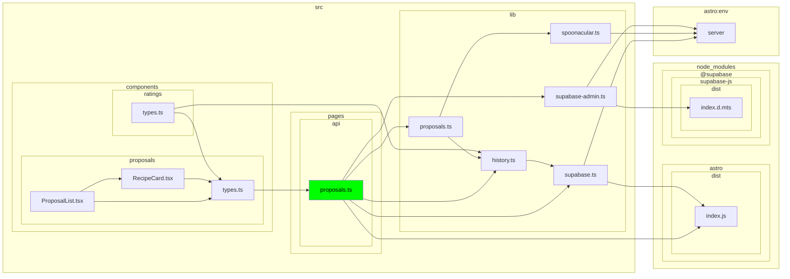

# Artefakt 2 — Mapa strukturalna (dependency-cruiser)

**Data analizy:** 2026-08-10 · **Gałąź:** `master` · **Narzędzie:** dependency-cruiser 18.1.1

**Uwaga o adaptacji promptów:** oryginalna seria promptów zakładała strukturę katalogów typu `channels/src/components/admin_console`, `platform/client/src`, `platform/types/src` (układ w stylu Mattermost — osobne pakiety `channels`/`platform`). Ten projekt (`Co_jemy`) jest płaskim monolitem Astro bez takiego podziału. Analizę przeprowadzono na realnych "gorących" obszarach z `artifact-1-territory.md`:

| Rola w oryginalnym prompt-chainie | Realny odpowiednik w tym repo |
|---|---|
| `channels/src/components/admin_console` | `src/components/proposals`, `src/components/ratings`, `src/components/auth` |
| `channels/src/actions` | `src/pages/api` |
| `channels/src/packages` / `channels/src/utils` | `src/lib` |
| `platform/client/src` | `src/lib` (klienci: `supabase.ts`, `supabase-admin.ts`, `spoonacular.ts`) |
| `platform/types/src` | `src/components/proposals/types.ts` (+ `src/components/ratings/types.ts`) |

---

## 1. Konfiguracja narzędzia

`dependency-cruiser@18.1.1` był już zainstalowany jako devDependency, a `.dependency-cruiser.cjs` już istniał w repo (skonfigurowany tego samego dnia) z regułami: `no-circular` (error), `no-orphans` (warn, z wyjątkami dla plików Astro), `no-deprecated-core`, `not-to-unresolvable`, `no-duplicate-dep-types`, `not-to-dev-dep`, `no-test-in-src`, `no-non-package-json`. Resolver ma poprawnie skonfigurowane rozszerzenia `.astro`, `tsConfig`, i wyklucza `dist/`, `.astro/`, `astro:*` (moduły wirtualne Astro).

Walidacja (`npx depcruise src --config .dependency-cruiser.cjs --output-type err-long`):

```
warn no-orphans: src/lib/config-status.ts
x 1 dependency violations (0 errors, 1 warnings). 48 modules, 95 dependencies cruised.
```

Jedyne odchylenie: `src/lib/config-status.ts` nie jest przez nikogo importowany i sam niczego nie importuje — kandydat na martwy kod, wart weryfikacji ręcznej (być może odczytywany dynamicznie lub zapomniany po spike'u).

---

## 2. Rozpoznanie możliwości — top 3 pomysły + dostępne raporty

**Top 3 pomysły na eksplorację tego repo:**

1. **Metryki stabilności (Ca/Ce/Instability) na `src/lib` i `src/pages/api`** — te dwa katalogi to węzły sprzężeń wg mapy terytorium; metryka instability (Ce/(Ca+Ce)) pokaże, czy `src/lib/supabase.ts` (wysoki fan-in) rzeczywiście zachowuje się jak stabilny fundament, czy jest zbyt często zmieniany mimo wielu zależnych.
2. **`--affected` względem commita sprzed pivotu Spoonacular (18.07)** — pokaże dokładnie, które moduły zmieniły się od retrieval-pivotu i czy któryś ze "starych" (pre-Spoonacular) plików wciąż jest importowany — szybka weryfikacja tezy z artefaktu 1 o ostrej granicy historycznej.
3. **`no-orphans` jako regularny sanity-check w CI** — reguła już istnieje w configu; w młodym, szybko rozwijanym repo (68 commitów/3 miesiące) orphany to najtańszy sygnał martwego kodu, zanim urośnie dług.

**Dostępne typy raportów** (`--output-type`): `err`/`err-long`/`err-html` (naruszenia reguł), `dot`/`ddot`/`archi`/`flat`/`mermaid`/`d2` (grafy wizualne), `json`/`anon` (dane surowe), `html` (macierz zależności), `csv`, `text`, `metrics` (Ca/Ce/Instability per moduł), `markdown`, `teamcity`/`azure-devops` (CI).

---

## 3. Cykle w aktywnych obszarach

### 3-5 najważniejszych obserwacji

1. **Zero cykli w całym `src/`** — nie tylko w obszarach aktywnych z artefaktu 1, w całym drzewie kodu aplikacyjnego. Reguła `no-circular` (severity: error) zwróciła 0 naruszeń na 95 przeanalizowanych zależności.
2. To potwierdza wniosek z artefaktu 1 o "czystej granicy dostawcy" — `spoonacular.ts` ma fan-out 0 (nic nie importuje lokalnie) i jest importowany tylko przez `proposals.ts` + własne testy, więc nie ma nawet okazji do cyklu.
3. Brak cykli przy 68 commitach i 3 miesiącach pracy nie jest przypadkiem — struktura `src/` nigdy nie była przenoszona/zmieniana nazwami (patrz artefakt 1, sekcja 5), więc nie było okazji do przypadkowego domknięcia pętli importów.
4. Ryzyko na przyszłość: `src/pages/api/proposals.ts` ma teraz fan-out 5 (dwóch klientów Supabase + `proposals.ts` + `history.ts` + Astro core) — to kandydat, który najłatwiej mógłby wciągnąć cykl, gdyby `src/lib/history.ts` lub `src/lib/proposals.ts` zaczęły z powrotem importować coś z `src/pages/api` (obecnie nie importują).
5. Rekomendacja: utrzymać `no-circular` jako `error` w CI/pre-commit — przy tak płaskiej strukturze koszt utrzymania tej gwarancji jest bliski zeru, a zapobiega dokładnie temu ryzyku z punktu 4.

### Tabela

| Obszar | Co znalazłem | Dowód z dependency-cruiser | Dlaczego to ważne przy zmianie | Związek z artifact-1-territory.md | Co sprawdzić dalej |
|---|---|---|---|---|---|
| `src/lib` (proposals/history/spoonacular) | Brak cykli | 0 z 0 krawędzi z `circular: true` w pełnym JSON grafie | Oś propozycji (60% aktywności kodowej wg artefaktu 1) może się bezpiecznie refaktoryzować bez ryzyka pętli inicjalizacji modułów | Sekcja 1 i 3 artefaktu 1: "oś propozycji" to `proposals.ts`+`spoonacular.ts`+`history.ts` | Dodać `no-circular` do CI, jeśli jeszcze nie jest wymuszane poza lokalnym lintem |
| `src/pages/api` | Brak cykli, ale najwyższy fan-out (5) w aktywnych obszarach | `proposals.ts → {supabase.ts, supabase-admin.ts, proposals.ts(lib), history.ts}` | Węzeł sprzężeń wg artefaktu 1 — każda zmiana funkcjonalna tu przechodzi; brak cykli dziś nie gwarantuje braku jutro | Sekcja 3, wniosek 1: "węzeł centralny całego repo" | Monitorować fan-out tego pliku przy każdym PR dodającym import z `src/lib` |
| `src/components/proposals`, `src/components/ratings` | Brak cykli; `types.ts` w obu katalogach są połączone (patrz sekcja 4) | `ratings/types.ts → proposals/types.ts` (jednokierunkowo, `export type`) | Potwierdza hipotezę z artefaktu 1 o wspólnym modelu przepisu między kartą a listą ocen | Sekcja 3, wniosek 2: "kandydat na wspólny typ zamiast dwóch równoległych" | Zweryfikować, czy to `export type` (patrz sekcja 4) — jeśli tak, ryzyko cyklu praktycznie zerowe |

---

## 4. Granice warstw

### 3-5 najważniejszych obserwacji

1. **Adaptacja granicy:** zamiast `platform/types` → `platform/client` → `channels`, sprawdzono: `src/components/proposals/types.ts` (fundament typów) → `src/lib` (domena/klienci) → `src/components`+`src/pages` (UI/routing).
2. **Pozorna inwersja jest w rzeczywistości bezpiecznym wzorcem:** `src/components/proposals/types.ts` importuje z `src/pages/api/proposals.ts` i `src/pages/api/ratings.ts`, a `src/components/ratings/types.ts` importuje z `src/lib/history.ts` i z `proposals/types.ts` — ale **wszystkie te importy to `import type` / `export type`**, więc są usuwane w całości na etapie kompilacji (zero runtime coupling, zero ryzyka bundlowania kodu serwerowego do klienta).
3. To jest udokumentowana, celowa dyscyplina w kodzie (komentarz w `ratings/types.ts`: *"every shape is owned by the endpoint or lib that produces it and re-exported type-only"*) — jeden punkt prawdy per kształt danych, bez ręcznie synchronizowanych kopii.
4. **Granica dostawcy (`spoonacular.ts`) pozostaje czysta**, zgodnie z artefaktem 1: importowana wyłącznie przez `src/lib/proposals.ts` i własne testy — zero fan-in z warstwy UI czy API bezpośrednio.
5. **Zero nielegalnych importów runtime** w kierunku "w górę" (domena → UI, fundament-typów → cokolwiek poza type-only) — jedyne dwie krawędzie sklasyfikowane jako "upward" w automatycznym skanie okazały się `import type`, więc po przefiltrowaniu runtime naruszeń jest 0.

### Tabela

| Sprawdzana granica | Wynik | Dowód z dependency-cruiser | Dlaczego to ważne przy zmianie | Związek z artifact-1-territory.md | Co sprawdzić dalej |
|---|---|---|---|---|---|
| `types.ts` (fundament) nie powinien zależeć runtime od API/domeny | ✅ Przechodzi (tylko type-only) | `src/components/proposals/types.ts → src/pages/api/{proposals,ratings}.ts` — oba `import type` (linie 14, 26 pliku) | Zmiana kształtu odpowiedzi API nie może przypadkiem pociągnąć kodu serwerowego do bundla klienta | Sekcja 3, wniosek 2 artefaktu 1 | Rozważyć regułę dependency-cruiser wymuszającą `dependencyTypesNot: ["type-only"]` dla tej konkretnej krawędzi, żeby inwersja pozostała gwarantowana, nie tylko przypadkowa |
| `src/lib` (domena/klienci) nie powinien zależeć od `src/components`/`src/pages` | ✅ Przechodzi, 0 krawędzi | Skan pełnego grafu: 0 edges `src/lib/* → src/components/*|src/pages/*` | Domena propozycji musi pozostać testowalna niezależnie od UI i routingu | Sekcja 1 artefaktu 1: "oś propozycji" jako serce projektu | — |
| Granica dostawcy: `spoonacular.ts` izolowany od UI/API | ✅ Przechodzi | Importerzy `spoonacular.ts`: tylko `src/lib/proposals.ts` + 2 pliki testowe | Zgodność z FR-011 — dane dostawcy nie powinny "wyciekać" poza wąski punkt kontaktu | Sekcja 3, wniosek 3 artefaktu 1: "granica providera jest domknięta czysto" | — |
| `ratings/types.ts` ↔ `proposals/types.ts` — czy współdzielenie typu jest jednokierunkowe | ✅ Jednokierunkowe (`ratings` → `proposals`, nie odwrotnie) | `Q["types.ts"] --> 5["types.ts"]` w wygenerowanym grafie (patrz sekcja 6) | Potwierdza, że `RatingResponse` ma jedno źródło prawdy w `proposals/types.ts` | Sekcja 3, wniosek 2 artefaktu 1 | — |

---

## 5. Ryzyka testowalności

### Podsumowanie

Analiza fan-in/fan-out (liczba modułów zależnych / liczba zależności) na aktywnych obszarach pokazuje jeden wyraźny hub: `src/lib/supabase.ts` (fan-in 12 — najwyżej sprzężony moduł w repo) oraz jeden wyraźny węzeł orkiestracji: `src/pages/api/proposals.ts` (fan-out 5, łączy dwóch klientów Supabase + całą domenę propozycji + historię). Testy jednostkowe już poprawnie to rozpoznają — `proposals.test.ts` mockuje 4 moduły (`supabase`, `supabase-admin`, `history`, `proposals`) zamiast testować przez rzeczywistą bazę. Braki: brak testu e2e dla ścieżki propozycje→ocena, mimo że to główna pętla produktu (US-01/US-02 z PRD).

### Lista ryzyk testowych

| Moduł | Fan-in / Fan-out | Ryzyko | Rekomendacja |
|---|---|---|---|
| `src/lib/supabase.ts` | 12 / 2 | Najwyżej sprzężony moduł w repo — fabryka klienta Supabase. Zmiana sygnatury `createClient` uderza we wszystko, co dotyka DB | Traktować jako stabilny fundament (contract test), nie zmieniać sygnatury bez przeglądu wszystkich 12 zależnych |
| `src/pages/api/proposals.ts` | 2 / 5 | Węzeł orkiestracji: 2 klienty Supabase (user + admin), `proposals.ts`, `history.ts`. Testowanie w izolacji wymaga min. 4 mocków | Już zamockowane w `proposals.test.ts` — dobry wzorzec, utrzymać. Ryzyko nie w unit testach, lecz w braku integracyjnego/e2e pokrycia (patrz niżej) |
| `src/lib/history.ts` | 5 / 1 | Ciągnie za sobą schemat bazy (wg artefaktu 1) — 4 funkcje (`getRecentLikes`, `getStaleLikes`, `getDislikedIds`, `getTopCuisine`) wywoływane równolegle w `proposals.ts` | Dobry kandydat na test integracyjny z lokalną instancją Supabase (już jest `supabase/migrations`), nie tylko mocki |
| `src/components/proposals/RecipeCard.tsx`, `ProposalList.tsx` | 0-1 / 5-6 | Zero fan-in (końcowe liście drzewa importów) — bezpieczne do testowania w izolacji, ale opierają się na `types.ts` importowanym type-only z API | Test jednostkowy/RTL wystarczy — nie potrzebują integracji z backendem |
| `src/components/auth/SignInForm.tsx`, `SignUpForm.tsx` | 0 / 6 | Formularze auth — zbudowane w Q2, "zamrożone" (artefakt 1) | Niski priorytet nowych testów — stabilny, rzadko dotykany kod |
| Cała pętla `POST /api/proposals` end-to-end | n/d | Brak testu e2e mimo że to główna pętla produktu (US-01: request → 4 propozycje → klik → link zewnętrzny → ocena → wpływ na przyszłe propozycje) | Kandydat na Playwright e2e — patrz `/10x-e2e` w tym repo |

### Najbardziej podejrzane moduły

- **`src/lib/supabase.ts`** — jedyny moduł z fan-in w dwucyfrowym zakresie; każda zmiana tu jest zmianą o najszerszym blast radius w repo.
- **`src/pages/api/proposals.ts`** — najwyższy fan-out w aktywnych obszarach; jedyny plik łączący oba klienty Supabase (user-scoped + service-role/admin) w jednej funkcji (`persist`), co samo w sobie jest podwyższonym ryzykiem (błąd w wyborze klienta = błąd uprawnień RLS).
- **`src/lib/config-status.ts`** — orphan (0 fan-in, 0 fan-out) zgłoszony przez regułę `no-orphans`; zanim napiszesz dla niego test, zweryfikuj czy w ogóle jest używany w runtime (może być odczytywany dynamicznie, np. w health-checku).

### Co sprawdzić dalej

1. Czy `e2e/` powinien dostać scenariusz dla `POST /api/proposals` → render karty → klik `sourceUrl` → powrót → ocena — to jedyna pętla z PRD bez pokrycia przeglądarkowego.
2. Czy `src/lib/config-status.ts` jest martwym kodem, czy używany poza grafem importów statycznych (dynamic import / runtime string lookup).
3. Metryki `Ca/Ce/Instability` (`--output-type metrics`) dla `src/lib/supabase.ts` — czy jest równie stabilny (rzadko zmieniany), jak sugeruje jego wysoki fan-in.

### Opcjonalny kolejny krok: graf

Wyrenderowano poniżej (sekcja 6) zamiast pełnego grafu `webapp`.

---

## 6. Wyrenderowany podgraf

**Pytanie, na które odpowiada graf:** co dokładnie dotyka `src/pages/api/proposals.ts` — najwyższy fan-out węzeł w aktywnych obszarach — bezpośrednio i pośrednio (głębokość 2), z pominięciem testów?

**Uwaga o narzędziu:** Graphviz (`dot`) nie jest zainstalowany w tym środowisku (`dot -V` → command not found), więc zamiast SVG użyto natywnego wyjścia `--output-type mermaid` dependency-cruiser (renderuje się tak samo czytelnie, bez zależności od systemowego binarki).

Komenda:
```
npx depcruise src --config .dependency-cruiser.cjs --output-type mermaid \
  --focus "^src/pages/api/proposals\.ts$" --focus-depth 2 \
  --exclude "\.(test|spec)\.(ts|tsx)$|__tests__"
```



Czytanie grafu: zielony węzeł (`proposals.ts` w `pages/api`) to jedyny punkt, przez który przechodzą oba klienty Supabase (`F`=`supabase.ts`, `K`=`supabase-admin.ts`), cała domena (`I`=`lib/proposals.ts` → `J`=`spoonacular.ts`) i historia ocen (`E`=`history.ts`) — dokładnie potwierdza rolę "węzła centralnego" z artefaktu 1 i tabelę ryzyk testowych z sekcji 5.

---

## Podsumowanie

1. **Struktura kodu jest czysta**: zero cykli w całym `src/`, granice warstw (typy/domena/UI) respektowane co do runtime — jedyne "przekroczenia" to celowe, udokumentowane `import type` re-eksporty, nie prawdziwe sprzężenie.
2. **Dwa realne punkty ryzyka**: `src/lib/supabase.ts` (najwyższy fan-in, fundament DB) i `src/pages/api/proposals.ts` (najwyższy fan-out, orkiestracja). Oba pokrywają się z wnioskami z artefaktu 1 o "osi propozycji" i "węźle sprzężeń".
3. **Testowalność jest już częściowo zaadresowana**: unit testy poprawnie mockują kolaboratorów `proposals.ts`. Największa luka to brak e2e dla głównej pętli produktu (US-01).
4. **Jeden martwy trop**: `src/lib/config-status.ts` — orphan, wart 5-minutowej weryfikacji, czy jest używany.
5. **Adaptacja prompt-chainu**: oryginalne prompty zakładały strukturę `channels`/`platform` nieobecną w tym repo; wszystkie kroki wykonano na realnych ścieżkach z `artifact-1-territory.md` (tabela mapowania na górze dokumentu).
