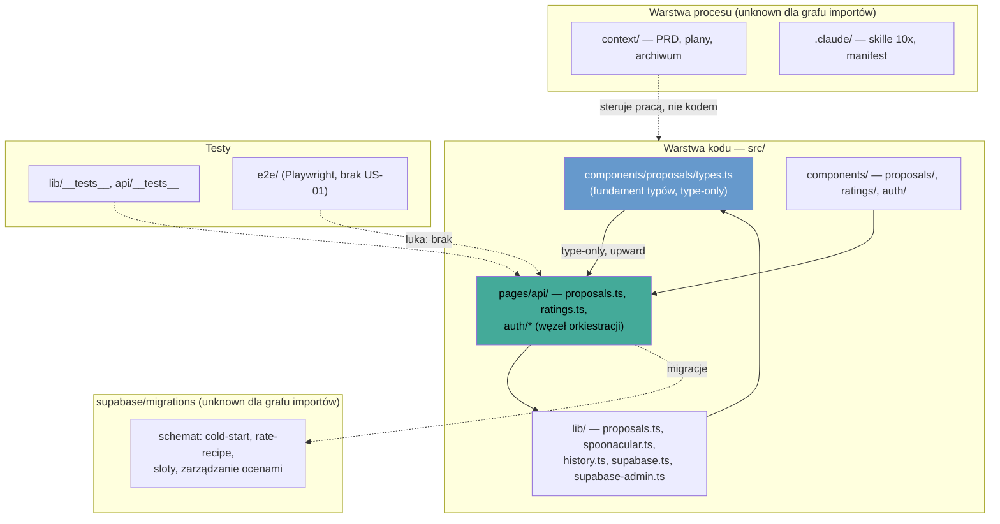

# Repo Map — Co jemy?

**Zbudowano z:** [`artifact-1-territory.md`](artifact-1-territory.md) (aktywność/git) · [`artifact-2-structure.md`](artifact-2-structure.md) (graf importów, dependency-cruiser) · [`artifact-3-contributors.md`](artifact-3-contributors.md) (kontrybutorzy)
**Data:** 2026-08-10 · **Skorygowano:** 2026-08-10 na podstawie [`../changes/proposals-dataflow/research.md`](../changes/proposals-dataflow/research.md) (sekcje 2, 3, 4 — ryzyka #1, #3, #4, #5) · **Okno danych:** cała historia repo, 68 commitów, 2026-05-23 → 2026-08-10 (~3 miesiące, nie 12 — patrz [Ograniczenia](#7-ograniczenia))

---

## 1. TL;DR

„Co jemy?" to płaski monolit Astro (SSR) + React + Supabase, który proponuje użytkownikowi do 4 przepisów na bazie historii ocen 👍/👎, pobieranych na żywo ze Spoonacular Food API. Repo dzieli się wyraźnie na **warstwę procesu** (`context/`, `.claude/` — PRD, plany zmian, skille toolkitu 10x) i **warstwę kodu** (`src/`, `supabase/`, `e2e/`); pierwsza dominuje liczbą dotknięć w gicie, ale to artefakt metodologii pracy z AI-agentem, nie miejsce, gdzie żyje logika produktu. Praca skupia się w jednym gorącym rdzeniu: oś propozycji `lib/proposals.ts` + `lib/spoonacular.ts` + `lib/history.ts` → `api/proposals.ts` → `components/proposals/*`, czyli dokładnie pętla FR-003/FR-008 z PRD. Strukturalnie kod jest czysty — zero cykli importów, granice warstw (typy → domena → UI) respektowane — ale ma dwa punkty o realnie szerokim blast radius: `supabase.ts` (fundament DB, fan-in 12) i `api/proposals.ts` (węzeł orkiestracji, fan-out 5). Boli najbardziej brak testu e2e dla głównej pętli produktu (request → 4 propozycje → klik → ocena) oraz to, że cała wiedza kontekstowa siedzi u jednej osoby — bus factor repo to 1.

---

## 2. Teren

**Duża odpowiedzialność, głęboko sprzężone:**
`src/pages/api/proposals.ts` i `src/lib/history.ts` — to dwa moduły, przez które przechodzi niemal każda zmiana funkcjonalna (git: najczęściej współwystępujące pary/trójki katalogów; graf importów: najwyższy fan-out w repo). `src/lib/supabase.ts` jest strukturalnie głęboki mimo niskiej częstotliwości zmian — fan-in 12, największy w repo, ale rzadko dotykany po zbudowaniu w `production-auth-loop` (07-20).

**Płytkie / peryferyjne:**
`src/components/auth`, `src/pages/auth` — zbudowane w Q2 (czerwiec), potem prawie nietykane. `src/lib/config-status.ts` — pokazywał się jako orphan w grafie importów (0 fan-in, 0 fan-out); **weryfikacja 2026-08-10: jest używany przez `src/layouts/Layout.astro:4`** (baner konfiguracyjny), orphan był artefaktem zakresu narzędzia, nie martwym kodem.

**Aktywność w czasie — dwie epoki, ostra granica 18.07.2026:**

| Okres | Charakter | Dowód |
|---|---|---|
| Q2 (23.05–07.06) | Fundamenty: wybór stacku, scaffolding, PRD, pełna pętla auth | `.claude/skills/10x-bootstrapper` (9), `src/components/auth` (6) |
| **Pivot 18–19.07** | Retrieval AI-search → Spoonacular API | PRD i tech-stack mają wpisane „Revised 2026-07-18" |
| Q3 (lip–sie) | Produkt: retrieval, sloty, oceny, testy — 30 commitów w 3 dni sierpnia | `src/pages/api` (20), `src/components/proposals` (17) |

Wszystko sprzed pivotu w obszarze retrievalu jest historycznie nieaktualne — nie opierać na tym analizy.

**Struktura katalogów vs realna aktywność — gdzie się rozjeżdżają:**
Licząc surowe dotknięcia w gicie, `context/changes` (90) i `.claude/skills` (57) biją na głowę `src/pages` (32) — ale to złudne: `context/changes/<id>` → `context/archive/<data>-<id>` to *przenosiny* skończonej pracy (skill `/10x-archive`), więc git liczy to podwójnie i zawyża rankingi warstwy procesu ~2×. Podobnie `.claude/.10x-cli-manifest.json` (9 dotknięć, lider współzmian z 59 obszarami) jest plikiem *generowanym* przez toolkit przy każdej aktualizacji skilli — nie jest to sygnał sprzężenia logicznego, to szum infrastruktury narzędzia. Po odfiltrowaniu tych dwóch efektów realny obraz aktywności to `src/pages/api` i `src/components/proposals` jako liderzy kodu aplikacyjnego.

---

## 3. Realne powiązania

### Co naprawdę zmienia się razem — i skąd to wiadomo

| Sprzężenie | Źródło dowodu | Charakter |
|---|---|---|
| `api/proposals.ts` ↔ `lib/{proposals,history,spoonacular}.ts` ↔ `components/proposals/*` | **Graf importów** (dependency-cruiser, runtime edges) + git (współwystępowanie w commitach) | Ręczne, silne — to jest oś produktu |
| `components/proposals/types.ts` ↔ `components/ratings/types.ts` | **Graf importów**: `ratings/types.ts → proposals/types.ts`, jednokierunkowo, wyłącznie `import type` | Ręczne, ale zero runtime coupling — typy usuwane w kompilacji |
| `lib/history.ts` ↔ `supabase/migrations` | **Git** (współwystępowanie w commitach; supabase/migrations poza grafem importów TS) | Ręczne — jedyne miejsce, gdzie zmiana logiki domenowej regularnie wymusza migrację schematu. **Potwierdzone 2026-08-10: 2 z 4 commitów `history.ts` dotykają `20260809120000_personalized_proposal_slots.sql`**; widoki `liked_recipe_history` i `cuisine_affinity` ruszają się razem z `src/lib/history.ts:75,174` |
| `CLAUDE.md` ↔ prawie cały repo (54 różne obszary) | **Git** (współwystępowanie) | Ręczne, ale to sprzężenie warstwy wiedzy, nie kodu — każda decyzja architektoniczna dopisuje regułę |
| `context/changes/<id>` ↔ `context/archive/<data>-<id>` | **Git** (rename/move) | **Tanie — przez regenerację/przenosiny skryptem `/10x-archive`, nie ręczną edycję treści.** Nie liczyć jako realne sprzężenie przy ocenie kosztu zmiany. |
| `CLAUDE.md` ↔ `.claude/.10x-cli-manifest.json` (8 wspólnych commitów, najsilniejsza para w repo) | **Git** | **Tanie po stronie manifestu — plik jest generowany przez toolkit 10x-cli przy aktualizacji skilli, nie edytowany ręcznie.** CLAUDE.md samo jest ręczne. |
| `package.json` ↔ 39 różnych obszarów | **Git** | Sprzężenie przez zależności (instalacje pakietów), nie sprzężenie logiczne |

### Cykle

**Zero cykli w całym `src/`** (dependency-cruiser, reguła `no-circular: error`, 0 naruszeń na 95 zależności). Potwierdzone niezależnie przez git: struktura `src/` nigdy nie była przenoszona ani zmieniana nazwami przez całą historię repo — nie było okazji do przypadkowego domknięcia pętli importów.

### Granice warstw (graf importów, tylko `src/`)

- `types.ts` (fundament typów) → `pages/api/*` idzie **w górę**, ale wyłącznie jako `import type` — zero runtime coupling, to udokumentowana, celowa dyscyplina (komentarz w kodzie: „every shape is owned by the endpoint or lib that produces it and re-exported type-only").
- `src/lib` → `src/components` / `src/pages`: **0 krawędzi**. Domena jest testowalna niezależnie od UI.
- `spoonacular.ts`: importowany wyłącznie przez `lib/proposals.ts` + testy — granica providera jest czysta, zgodna z wymogiem izolacji danych z FR-011.

### `unknown` — gdzie nie ma grafu zależności

Dependency-cruiser objął wyłącznie `src/` (TypeScript/Astro). **Poniższe warstwy nie mają grafu importów — brak dowodu strukturalnego to `unknown`, nie „brak powiązań":**
- `supabase/migrations` (SQL) — powiązania z `lib/history.ts` znane tylko z git (współwystępowanie w commitach), nie z analizy zależności.
- `e2e/` (Playwright specs) — nie analizowane strukturalnie w ogóle.
- `context/` i `.claude/` (Markdown/JSON, warstwa procesu) — poza zakresem narzędzia z definicji; wszystko co wiadomo o nich pochodzi z historii gita (artefakt 1).

---

## 4. Strefy ryzyka

| # | Obszar | Dlaczego |
|---|---|---|
| 1 | `src/pages/api/proposals.ts` | Węzeł orkiestracji — jedyny plik łączący oba klienty Supabase (user + admin) w jednej funkcji; błąd w wyborze klienta = błąd uprawnień RLS. Najwyższy fan-out w repo (5). **Zweryfikowane 2026-08-10 (`proposals-dataflow/research.md` §1.5): rozdział klientów jest świadomą decyzją, nie przypadkiem** — `revoke insert on public.recipes from authenticated` (`supabase/migrations/20260809180000_manage_rated_recipes.sql:28-29`) jest przyczyną istnienia `createAdminClient()`; wszystko kluczowane userem zostało na kliencie sesyjnym, żeby RLS pozostało punktem egzekwowania. Ryzyko pozostaje jako powierzchnia regresji, ale nie jako otwarty problem projektowy. |
| 2 | `src/lib/supabase.ts` | Najwyższy fan-in w repo (12) — najszerszy blast radius przy zmianie sygnatury, mimo że rzadko zmieniany (fundament, nie aktywne pole pracy). |
| 3 | `src/lib/history.ts` | Jedyne miejsce, gdzie zmiana logiki domenowej regularnie ciągnie za sobą migrację schematu bazy — zmiana tu nie kończy się na kodzie TS. |
| 4 | Brak e2e dla głównej pętli produktu | US-01 (request → 4 propozycje → klik → link zewnętrzny → ocena → wpływ na przyszłe propozycje) nie ma pokrycia przeglądarkowego mimo istniejącego harnessu Playwright — regresja tu przejdzie niezauważona przez CI. **Potwierdzone i doprecyzowane 2026-08-10** (`proposals-dataflow/research.md` D-5): `e2e/` pokrywa tylko bramki auth i jedną asercję FR-010; brak kliknięcia 👍/👎, strony `/dashboard/ratings`, nazwy wydawcy, badge'ów slotów i asercji „👎 nigdy nie wraca". Dodatkowo `seed.spec.ts` używa współdzielonego konta, więc kryterium US-02 „min. 2 kuchnie" nie jest nigdzie sprawdzane. |
| 5 | ~~`src/lib/config-status.ts`~~ **— skorygowane 2026-08-10, nie jest ryzykiem** | Mapa raportowała orphana (0/0 w grafie importów). Weryfikacja w `proposals-dataflow/research.md` (D-14) pokazała, że plik **jest używany** — `src/layouts/Layout.astro:4` renderuje z niego baner konfiguracyjny. Orphan był artefaktem zakresu dependency-cruisera (pliki `.astro` nie były przeszukiwane jako importerzy), nie martwym kodem. |
| 6 | Bus factor = 1 na całej powierzchni kodu aplikacyjnego | Jeden kontrybutor-człowiek w całej historii; kontekst decyzji („dlaczego dwa klienty Supabase", „dlaczego offset capped na 900") nie jest odtwarzalny bez dostępu do niego lub do `context/changes`/`context/archive`. |

---

## 5. Kogo zapytać

Repo ma **jednego kontrybutora-człowieka w całej historii: KSchlagowski**. Commity `Co-Authored-By: Claude Opus 5 / Claude Fable 5` to narzędzie pair-programmingowe tej osoby, nie druga linia wsparcia — agent nie ma pamięci poza tym, co zapisane w `context/`. Poniższa tabela nie mapuje więc różnych ludzi na strefy — pokazuje, gdzie kontekst jest najgęstszy i najmniej odtwarzalny bez rozmowy z tą jedną osobą, w kolejności priorytetu dla przyszłego onboardingu drugiej osoby.

| Strefa (z sekcji 4) | Kandydat | Dlaczego akurat tu, konkretnie |
|---|---|---|
| 1, 2 — węzeł orkiestracji `api/proposals.ts`, fundament `supabase.ts` | KSchlagowski | Jedyna osoba, która przeszła pełną ewolucję tego pliku od bootstrapu (06-01) przez spike Spoonacular (07-18/19) po personalizację (08-09); `supabase.ts` zbudowany raz w `production-auth-loop` (07-20), kontekst „dlaczego user + admin client" istnieje tylko w tamtych commitach. |
| 3 — `history.ts` + migracje | KSchlagowski | Jedyna osoba, która widziała quota-crunch providera z pierwszej ręki (spike → hardening); „dlaczego limit offsetu = 900" nie jest odtwarzalne z samego kodu. |
| 4 — brak e2e US-01 | KSchlagowski | Ta sama osoba zbudowała cały harness testowy (Vitest 07-22, Playwright 07-24) — luka jest kontynuacją własnej, nieukończonej roboty, nie nieobecnością specjalisty QA. |
| 6 — brak drugiej osoby jako takiej | Historia commitów + `context/changes/*` / `context/archive/*` | Gdy KSchlagowski jest niedostępny: pliki PRD i plany zmian notują kontrargumenty (`Socrates:` w `prd.md`) — to faktyczny substytut pytania współpracownika w tym projekcie. |

Świadomie pominięte: `src/components/auth` + `src/pages/auth` — zamrożone od czerwca, niskie ryzyko, niski priorytet kontaktu.

---

## 6. Pierwszy dzień

Kolejność: od kontraktu produktu, przez oś domenową, do UI i testów.

1. [`context/foundation/prd.md`](../foundation/prd.md) — co appka ma robić i dlaczego (4 sloty, ograniczenia Spoonacular, non-goals). Bez tego reszta nie ma sensu.
2. [`CLAUDE.md`](../../CLAUDE.md) — konwencje, gotchas, budżet Spoonacular; jedyny plik, który zmienia się razem z niemal każdym obszarem repo.
3. [`src/pages/api/proposals.ts`](../../src/pages/api/proposals.ts) — węzeł orkiestracji; czytając ten plik widać całą oś domenową naraz (oba klienty Supabase, `lib/proposals`, `lib/history`).
4. [`src/lib/proposals.ts`](../../src/lib/proposals.ts) — logika 4 slotów (FR-008), serce reguł biznesowych.
5. [`src/lib/spoonacular.ts`](../../src/lib/spoonacular.ts) — granica providera; pokazuje wzorzec izolacji danych zewnętrznych (FR-011) i hardening przeciw 402/timeoutom.
6. [`src/lib/history.ts`](../../src/lib/history.ts) — historia ocen; jedyny plik ciągnący za sobą schemat bazy, więc czytać razem z `supabase/migrations/`.
7. [`src/components/proposals/RecipeCard.tsx`](../../src/components/proposals/RecipeCard.tsx) + [`types.ts`](../../src/components/proposals/types.ts) — jak kontrakt API (type-only) trafia do UI; zobacz też sprzężenie z `components/ratings/types.ts`.
8. [`src/pages/api/__tests__/proposals.test.ts`](../../src/pages/api/__tests__/proposals.test.ts) — wzorzec mockowania 4 kolaboratorów węzła orkiestracji; potem `e2e/` żeby zobaczyć, czego tam **nie ma** (US-01).

---

## 7. Ograniczenia

- **Okno czasowe:** cała historia repo to 68 commitów z 3 miesięcy (23.05–10.08.2026), nie 12 miesięcy — projekt jest zbyt młody, żeby mieć dłuższą historię. Traktować to jako „całą dostępną historię", nie jako reprezentatywne okno roczne.
- **Metoda:** trzy niezależne narzędzia — git log (aktywność/współzmiany), dependency-cruiser (graf importów statycznych TS/Astro, tylko `src/`), git author/trailers (kontrybutorzy). Żadne z nich nie analizuje runtime'u ani rzeczywistego zachowania appki.
- **Czego mapa NIE mówi:**
  - Nic o jakości logiki biznesowej ani poprawności reguł 4-slotowych — tylko o tym, gdzie leży i jak jest sprzężony kod, który je implementuje.
  - Nic strukturalnego o `supabase/migrations` (SQL), `e2e/` (Playwright) ani warstwie `context/`/`.claude/` — to `unknown` dla grafu importów, nie zweryfikowany brak powiązań (patrz sekcja 3).
  - Nic o przyszłych planach poza tym, co już jest w aktywnych `context/changes/*` w momencie analizy (m.in. `testing-harness-proposal-units`, `production-auth-loop`, `testing-storage-diversity-units`).
  - Nic o bus factor jako trwałej cesze — to zdjęcie stanu na 2026-08-10; jeśli dołączy druga osoba, część tej mapy (sekcja 5) się zdezaktualizuje pierwsza.
